# ChameleonOS System Architecture

ChameleonOS is a 100% self-hostable, offline-first hackathon management and judging platform built with FastAPI, SQLAlchemy, SQLite, and Jinja2.

```mermaid
graph TD
    Client[Browser / API Client] --> App[FastAPI Application Server]
    
    subgraph Core Services
        Auth[Auth & RBAC Service]
        Events[Events & Tracks Service]
        Submissions[Submissions & Teams Service]
        Judging[Judging & Scoring Service]
        Normalization[Z-Score Normalization Engine]
        Voting[Community Voting & Anti-Abuse]
        Themes[Adaptive Theming & Magic Morph]
    end

    subgraph Tier 4 Extensions
        Webhooks[Webhooks Dispatcher - HMAC-SHA256]
        Certificates[Certificates & Awards Verification]
        JudgeRecords[Signed Judge Participation Records]
        EmbedWidget[Zero-CDN Gallery Embed Widget]
        DataExchange[Bulk Import/Export Engine]
    end

    subgraph Persistence Layer
        DB[(SQLite Local Database ./data/chameleon.db)]
        AuditLog[(Tamper-Evident Audit Trail)]
    end

    App --> Auth
    App --> Events
    App --> Submissions
    App --> Judging
    App --> Normalization
    App --> Voting
    App --> Themes
    App --> Webhooks
    App --> Certificates
    App --> JudgeRecords
    App --> EmbedWidget
    App --> DataExchange

    Auth --> DB
    Events --> DB
    Submissions --> DB
    Judging --> DB
    Normalization --> DB
    Voting --> DB
    Webhooks --> DB
    Certificates --> DB
    JudgeRecords --> DB
    DataExchange --> DB
    App --> AuditLog
    AuditLog --> DB
```

---

## Tier Breakdown & Responsibilities

### Tier 1 — Core Platform
- **Role-based Authentication:** JWT Bearer tokens with offline seeding for `organizer`, `judge_a`, `judge_b`, `participant`, and `admin`.
- **Event Lifecycle:** Configurable start/end timestamps, challenge tracks, and prize tiers.
- **Team Formation & Project Drafts:** Team creation with invite tokens, drafting, and strict submission deadline enforcement.
- **Public Gallery:** Unauthenticated project gallery with search and track filtering.

### Tier 2 — Judging & Security
- **Weighted Rubrics:** Multi-criteria weighted rubrics per hackathon event.
- **Judge Assignment & Queue:** Deterministic auto-assignment and manual assignments.
- **Strict Isolation Boundary:** Cross-judge score isolation (judges cannot read peer evaluations; participants cannot access judging routes).
- **Audit Logging:** Every score submission, assignment, and status transition is recorded in the tamper-evident audit log.
- **RFC 4180 CSV Export:** Organizer-only export of final ranking matrix.

### Tier 3 — Community Voting & Anti-Abuse
- **Access Modes:** Open link (fingerprinted), email-gated (offline OTP verification tokens), and authenticated user voting.
- **Anti-Abuse Engine:** Sliding-window in-memory rate limiting and transactional duplicate ballot rejection.
- **Result Secrecy:** Voting tallies are strictly withheld from participants and judges until the voting campaign closes.
- **Project Comments:** Authenticated discussion with organizer moderation.
- **Ballot Randomization:** Deterministic per-client ballot shuffling to eliminate primacy bias.

### Tier 4 — Advanced Platform Extensions
- **Full REST API & OpenAPI:** 100% UI feature coverage accessible via programmatic REST API with OpenAPI specification at `/api/v1/openapi.json`.
- **Webhooks Subsystem:** Outbound HTTP event notifications signed with `HMAC-SHA256` in the `X-Chameleon-Signature` header, short timeouts, safe try/except delivery, and delivery history logs.
- **Certificates & Awards Generation:** Tamper-verifiable certificates with cryptographic tokens (`/verify/certificate/{token}`) and offline printable landscape certificates (`/certificates/{id}/printable`).
- **Signed Judge Participation Records:** Cryptographically signed participation records (`/verify/judge/{record_id}`) issued strictly upon 100% completion of assigned evaluations with canonical JSON serialization and tamper detection.
- **Embeddable Gallery Widget:** Self-contained, zero-CDN JavaScript widget (`/embed/gallery.js`) fetching sanitized submitted projects (`/api/v1/embed/events/{event_id}/projects`).
- **Bulk Import & Export:** Atomic transactional project/team imports (CSV & JSON) with row validation rollback, alongside multi-entity CSV and complete JSON bundle exports (`/api/v1/events/{event_id}/export/bundle.json`).

### Normalization Proof Bonus (+5)
- Deterministic cross-judge Z-score calculation balancing harsh and lenient judges, zero-variance evaluations, and unequal assignments. Detailed mathematical proof in [`JUDGING.md`](JUDGING.md).

### Product Innovation: Adaptive Visual System
- Six visual archetypes (`verdant`, `cosmos`, `arcade`, `monolith`, `bio`, `atelier`) altering 7 design dimensions.
- Deterministic offline **Magic Morph** configuring styling tokens from event metadata without external AI services.
