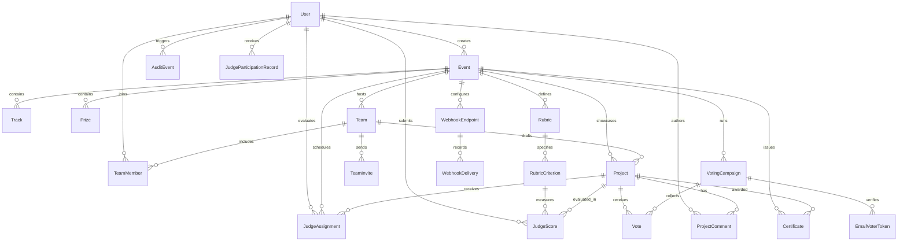

# ChameleonOS Data Model Specification

ChameleonOS employs SQLite via SQLAlchemy ORM with UTC timestamp storage.

---

## Entity Catalog

| Model | Table | Tier | Description |
| :--- | :--- | :--- | :--- |
| `User` | `users` | T1 | Platform user account with role (`organizer`, `judge`, `participant`, `admin`) and hashed password. |
| `Event` | `events` | T1 | Hackathon event container with timeline, submission phases, and theme configuration. |
| `Track` | `tracks` | T1 | Challenge track category for targeted submissions. |
| `Prize` | `prizes` | T1 | Award bounty description and monetary/distinction value. |
| `Team` | `teams` | T1 | Participant squad with lead user and slug. |
| `TeamMember` | `team_members` | T1 | Association mapping users to teams with role (`lead`, `member`). |
| `TeamInvite` | `team_invites` | T1 | Cryptographic invite tokens for team invitations. |
| `Project` | `projects` | T1 | Hackathon submission draft or locked submission with demo/code links. |
| `Rubric` | `rubrics` | T2 | Evaluation rubric defined per event. |
| `RubricCriterion` | `rubric_criteria` | T2 | Scored dimension with weight, min score, and max score. |
| `JudgeAssignment` | `judge_assignments` | T2 | Queue assignment connecting judge, project, and status. |
| `JudgeScore` | `judge_scores` | T2 | Immutable score evaluation per judge, project, and criterion. |
| `AuditEvent` | `audit_events` | T2 | Append-only audit record capturing user, action, IP, and payload. |
| `VotingCampaign` | `voting_campaigns` | T3 | Community voting campaign with access mode, window, and method. |
| `Vote` | `votes` | T3 | Cast ballot with voter key, weight, and anti-abuse audit. |
| `EmailVoterToken` | `email_voter_tokens` | T3 | Offline email verification token for gated voting. |
| `ProjectComment` | `project_comments` | T3 | Authenticated discussion comment on public project. |
| `WebhookEndpoint` | `webhook_endpoints` | T4 | Outbound HTTP webhook target with shared secret for HMAC-SHA256. |
| `WebhookDelivery` | `webhook_deliveries` | T4 | Recorded HTTP delivery attempt with status code and payload. |
| `Certificate` | `certificates` | T4 | Tamper-verifiable achievement award with unique verification token. |
| `JudgeParticipationRecord` | `judge_participation_records` | T4 | Verifiable record with canonical JSON and HMAC-SHA256 signature. |
